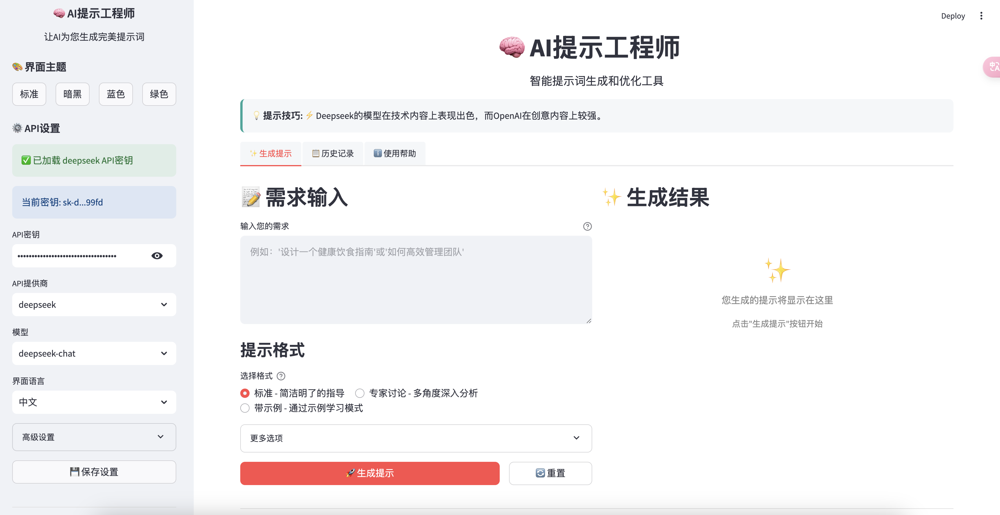

# AI提示工程师 2.0

这个项目提供了用于生成格式良好、详细的提示词的工具，基于自动提示工程（Automatic Prompt Engineering）的概念，并提供了美观易用的用户界面。



## 功能特点

- **直观美观的UI**：现代化设计，多种主题选择（包括暗黑模式）
- **暗黑模式支持**：新增暗黑模式，提供更舒适的视觉体验 (可在侧边栏主题选择器中切换)。
- **三种提示格式**：标准格式、专家讨论、带示例模式
- **历史记录**：保存和管理您生成的所有提示词
- **自定义设置**：灵活配置API参数和生成选项
- **多模型支持**：兼容DeepSeek、OpenAI及Anthropic Claude的多种模型
- **跨平台**：基于Web技术，可在任何设备上运行

## 组件

项目包含三个主要实现：

1. **auto_prompt_engineer.py**: 完整的APE实现，包括：
   - 执行任务的推断模型
   - 评估提示的评分模型
   - 可选的生成提示变体的重采样模型
   - 查找最佳提示的迭代优化过程

2. **prompt_engineer.py**: 简化的实用实现，它：
   - 连接到语言模型API生成提示
   - 提供三种格式：标准、专家讨论和基于示例
   - 可以使用或不使用API密钥（回退到模拟响应）

3. **streamlit_app.py**: 用户友好的图形界面，提供：
   - 简单直观的提示生成界面
   - 多种主题和自定义选项
   - 历史记录管理和提示复用功能
   - 详细的使用指南和提示技巧

## 安装

```bash
# 克隆仓库
git clone https://github.com/yourusername/auto-prompting_engineer.git
cd auto-prompting_engineer

# 安装所需包
pip install -r requirements.txt
```

## API密钥设置指南

本项目提供了多种设置API密钥的方式，以确保您的密钥安全：

### 方法1：使用环境变量（最安全）

Linux/macOS:
```bash
export DEEPSEEK_API_KEY="your_api_key_here"
export OPENAI_API_KEY="your_api_key_here"
export CLAUDE_API_KEY="your_claude_api_key_here"
```

Windows (CMD):
```cmd
set DEEPSEEK_API_KEY=your_api_key_here
set OPENAI_API_KEY=your_api_key_here
set CLAUDE_API_KEY=your_claude_api_key_here
```

Windows (PowerShell):
```powershell
$env:DEEPSEEK_API_KEY="your_api_key_here"
$env:OPENAI_API_KEY="your_api_key_here"
$env:CLAUDE_API_KEY="your_claude_api_key_here"
```

### 方法2：使用.env文件

1. 复制示例文件并重命名
```bash
cp .env.example .env
```

2. 编辑.env文件，添加您的API密钥
```
DEEPSEEK_API_KEY=your_deepseek_api_key_here
OPENAI_API_KEY=your_openai_api_key_here
CLAUDE_API_KEY=your_claude_api_key_here
```

### 方法3：使用Streamlit secrets

如果您使用Streamlit，可以创建一个secrets.toml文件：

```bash
mkdir -p .streamlit
touch .streamlit/secrets.toml
```

然后在secrets.toml中添加您的API密钥：
```toml
DEEPSEEK_API_KEY = "your_deepseek_api_key_here"
OPENAI_API_KEY = "your_openai_api_key_here"
CLAUDE_API_KEY = "your_claude_api_key_here"
```

### 方法4：使用API密钥管理工具

本项目提供了一个专门的API密钥管理工具：

```bash
python api_secrets.py --set --provider deepseek
# 或者 openai, claude
python api_secrets.py --set --provider claude
```

此工具会安全地提示您输入密钥，并指导您选择最安全的存储方式。

### 方法5：在图形界面中设置

启动应用后，您也可以在侧边栏中设置API密钥。务必注意，这种方式下密钥可能会存储在config.json文件中，不适合共享环境。

## 安全注意事项

为了保护您的API密钥：

1. **永远不要**将包含真实API密钥的文件上传到GitHub或其他公共仓库
2. .gitignore已配置为排除以下文件：
   - config.json (实际配置)
   - .env (环境变量)
   - .streamlit/secrets.toml (Streamlit密钥)
3. 如果您需要分享代码，请使用模板文件代替：
   - config.template.json
   - .env.example

## 使用方法

### 图形界面使用

启动图形界面:

```bash
streamlit run streamlit_app.py
```

使用图形界面:
1. 在左侧输入框中输入你的需求
2. 选择提示格式（标准、专家讨论或带示例）
3. 配置API设置（API密钥、提供商(如DeepSeek, OpenAI, Claude)、模型）
4. 点击"生成提示"按钮
5. 生成的提示将显示在右侧，可以复制或下载

### 命令行使用

#### 基本提示生成

生成标准格式的提示：

```bash
python prompt_engineer.py "创建一个城市园艺指南"
```

#### 专家讨论提示

生成模拟专家讨论主题的提示：

```bash
python prompt_engineer.py "设计一个可持续发展的智能城市" --format expert-panel
```

#### 包含示例的提示

生成包含示例以便更好理解的提示：

```bash
python prompt_engineer.py "为产品创建客户推荐" --format examples --examples examples.json
```

## 使用不同API提供商

使用Deepseek API生成提示：
```bash
python prompt_engineer.py "分析市场趋势" --api-provider deepseek --model deepseek-chat
```

使用OpenAI API生成提示：
```bash
python prompt_engineer.py "撰写一篇关于太空探索的博客文章" --api-provider openai --model gpt-3.5-turbo
```

使用Anthropic Claude API生成提示：
```bash
python prompt_engineer.py "总结人工智能的最新进展" --api-provider claude --model claude-3-opus-20240229
```

## 将项目上传到GitHub时的安全建议

如果您想将此项目上传到您自己的GitHub仓库，请遵循以下步骤以确保API密钥安全：

1. **检查敏感文件**：确保您不会上传包含真实API密钥的文件
   ```bash
   # 检查所有可能包含API密钥的文件
   grep -r "sk-" --include="*.py" --include="*.json" .
   ```

2. **删除敏感配置**：
   ```bash
   # 如果您已经使用过API密钥，请创建干净的模板
   python api_secrets.py --create-template
   ```

3. **确认.gitignore正常工作**：
   ```bash
   # 查看哪些文件会被提交
   git add .
   git status
   ```

4. **使用预提交检查**（可选）：
   ```bash
   # 安装预提交钩子以自动检测密钥泄露
   pip install pre-commit
   pre-commit install
   ```

## 示例JSON格式

`examples.json`文件应包含以下格式的输入输出对：

```json
[
  {
    "input": "创建营销活动",
    "output": "# 营销活动\n\n## 目标受众\n..."
  },
  {
    "input": "解释机器学习",
    "output": "# 机器学习解释\n\n..."
  }
]
```

## 系统要求

- Python 3.7+
- 网络连接（用于API调用）
- 支持现代Web浏览器（Chrome, Firefox, Safari, Edge等）

## 常见问题

**问**: 为什么我收到API错误？  
**答**: 请确保您的API密钥正确，并且有足够的配额。使用`python api_secrets.py --get`检查当前设置的API密钥。

**问**: 如何获得最佳结果？  
**答**: 提供详细、具体的需求描述，尝试不同的提示格式，并根据初始结果迭代改进。

**问**: 我可以保存我的配置吗？  
**答**: 是的，在侧边栏中点击"保存设置"按钮，设置将保存到config.json文件。请注意，保存API密钥到配置文件不是最安全的方法。

**问**: 如何防止API密钥泄露？  
**答**: 优先使用环境变量或.env文件存储密钥，并确保这些文件已添加到.gitignore中以避免上传到代码仓库。

## 许可证
JUNSHENGMA SONGFEN 爆杀肥尧
